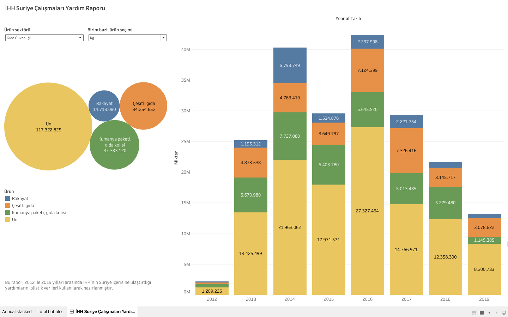
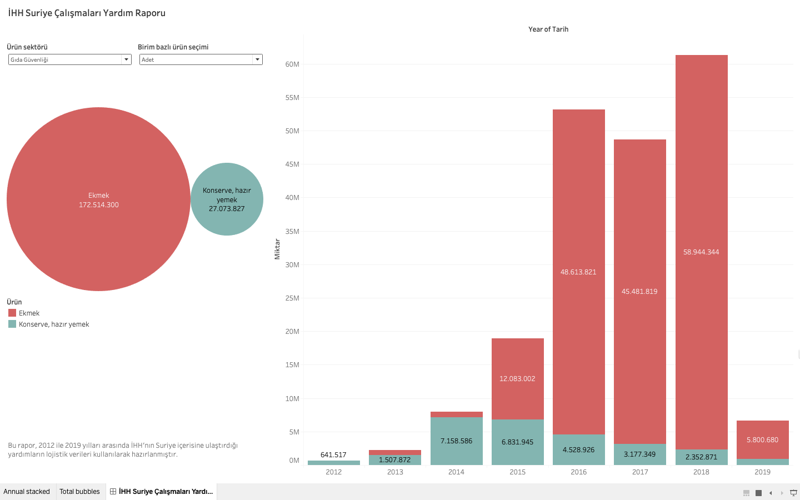
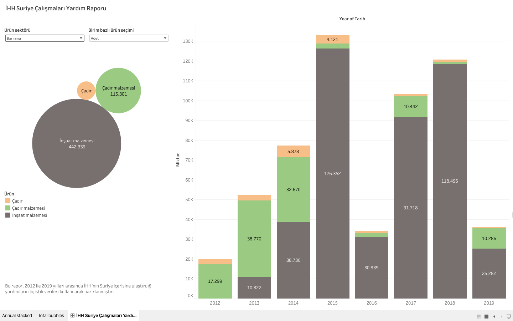
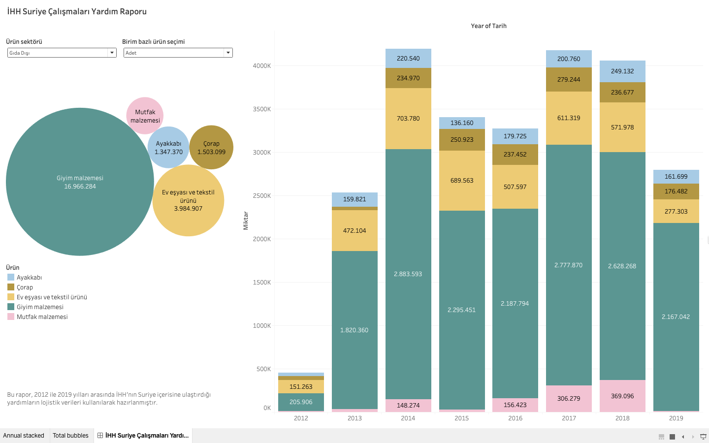
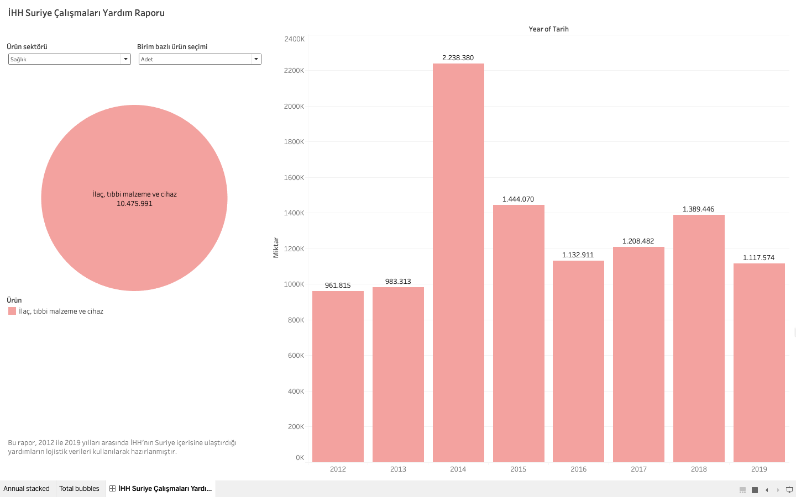
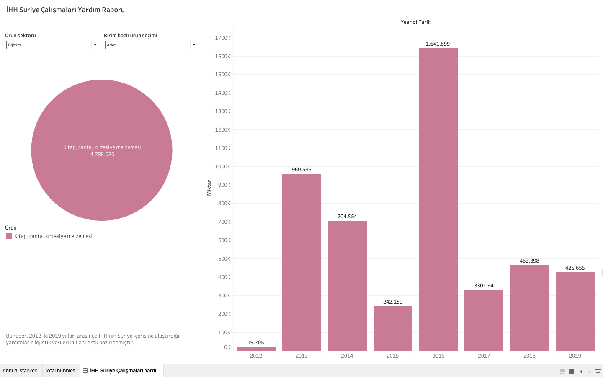
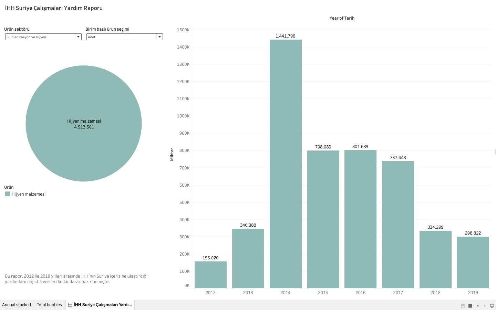

# İHH'nın Suriye çalışmaları yardım verileri

2011 yılında başlayan Suriye Savaşı esnasında İHH tarafından Suriye içerisine lojistik hizmetleriyle ulaştırılan yardımların miktarlarını yıl ve sektör bazında Tableau aracını kullanarak görselleştirdim.

:pick: Veri seti olarak İHH'nın kendi bünyesinde kullandığı yazılımdan kazıdığım verileri kullandım.

> *Özetle 2012 ile 2019 yılları arasında Suriyeli mültecilere 172 milyon adet ekmek, 27 milyon adet hazır yemek ve konserve, 203 bin ton gıda, 7.7 bin ton yakacak, 1.2 milyon litre yakıt, 20 milyon adet giyim, 5 milyon adet mutfak ürünü, 4.7 milyon adet kitap ve kırtasiye malzemesi, 10 milyon adet ilaç, tıbbi malzeme ve cihaz, 4.9 milyon adet de hijyen malzemesi ulaştırılmış.*

:bar_chart: Görselleştirmeyi interaktif olarak [buradan](https://public.tableau.com/profile/bekirarslan#!/vizhome/SyriaAidReport2012-2019Logistics/HHSuriyealmalarYardmRaporu), grafik örneklerini aşağıdan inceleyebilirsiniz.

